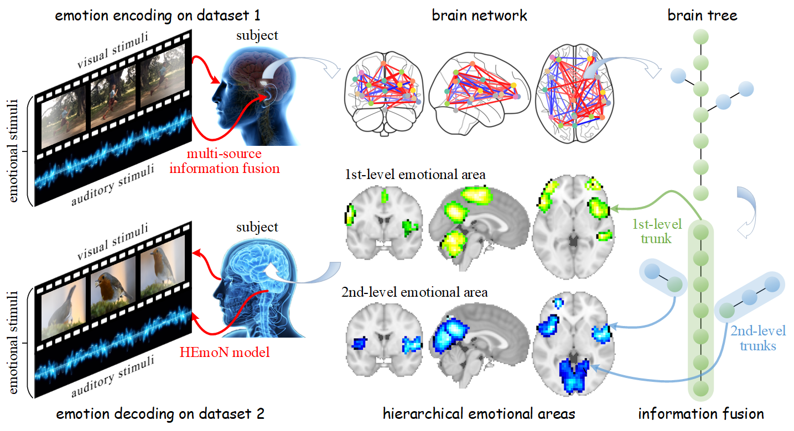

# Hierarchical Emotion Network (HEmoN)

The official implementation of **[Identifying the Hierarchical Emotional Areas in the Human Brain Through Information Fusion](https://www.sciencedirect.com/science/article/pii/S1566253524003919) (InfFus 2024)**.



## 1&nbsp; Installation Instructions

Follow the steps below to set up the virtual environment.

Create and activate the environment:
```shell
conda create -n hemon python=3.6
conda activate hemon
```

Install dependencies:
```shell
pip install -r requirements.txt
```

## 2&nbsp; Experiments

The emotion ratings and the preprocessed fMRI data are available on the [Open Science Framework (OSF)](https://osf.io/tzpdf).
We have downloaded the `raw_ratings.mat` file containing the emotion ratings and placed it in the `data/behavioral_ratings/` sub-folder of this repository.
However, we do not provide the fMRI data here since each file is around 1GB in size.
Please download the required fMRI data and place them in the `data/fMRI_data/` sub-folder.
The overall structure of the `data` folder should look like this:
```
data/
  ├───behavioral_ratings/
  │     └───raw_ratings.mat
  └───fMRI_data/
        ├───single_sub_uncleaned_smooth_fwhm6/
        │     └───sub-02.nii.gz
        │         sub-03.nii.gz
        │         ...
        │         sub-20.nii.gz
        └───average_epi_nonlin_smooth_fwhm6.nii.gz
```
You can refer to the [official website](https://osf.io/tzpdf) of Lettieri et al. for more details about the data.

After obtaining the necessary data, execute the following command to reproduce the results shown in Figure 2:
```shell
python plot.py
```

## 3&nbsp; Citation

If you find this code or our paper helpful for your research, please cite our paper using the following information:

```bibtex
@article{huang2024identifying,
  title   = {Identifying the Hierarchical Emotional Areas in the Human Brain Through Information Fusion},
  author  = {Huang, Zhongyu and Du, Changde and Li, Chaozhuo and Fu, Kaicheng and He, Huiguang},
  journal = {Information Fusion},
  year    = {2024}
}
```
